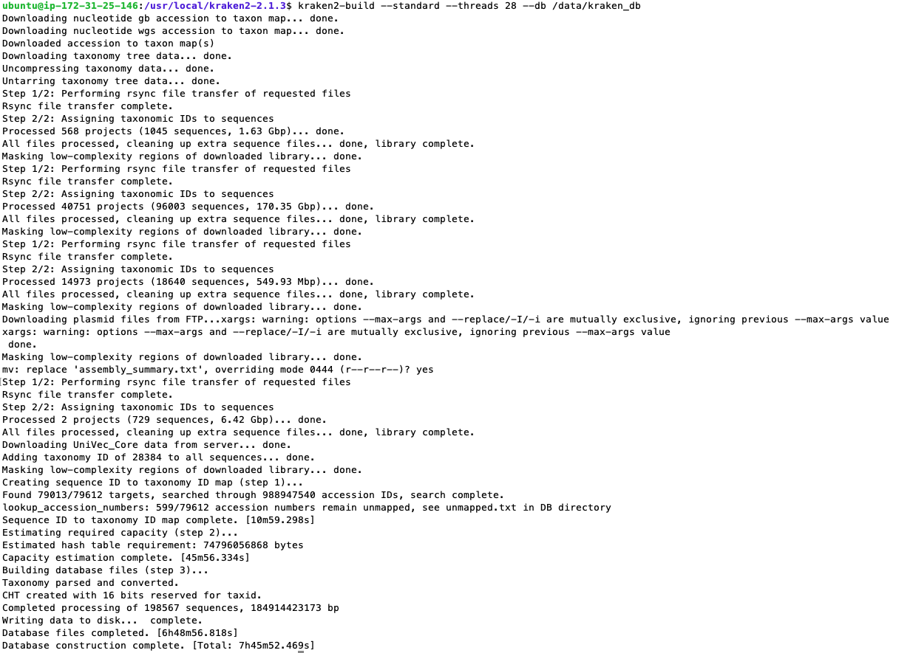

## <ins>Profiling content for AWS Ec2 and AWS EFS</ins>

1. [Profiling information](https://github.com/ldipotetjob/kraken2/blob/kraken2aws_profilingfromv2.1.3/docs/awsStandardDB/profiling.md#profiling-information)
2. [Ec2 instance](https://github.com/ldipotetjob/kraken2/blob/kraken2aws_profilingfromv2.1.3/docs/awsStandardDB/profiling.md#ec2-instance)
3. [EFS](https://github.com/ldipotetjob/kraken2/blob/kraken2aws_profilingfromv2.1.3/docs/awsStandardDB/profiling.md#efs)

### Profiling information

This is the profiling information based on the construction of Kraken2 Standard DB. We have followed the documentation when creating standard kraken2 db:

```shell
kraken2-build --standard --threads 32 --db $DBNAME
```
Our Data Base $DBNAME will be hosted on **AWS EFS** 

### Ec2 instance: 

Referenced EC2 image:</br> 
Memory optimized instance: **r4.8xlarge**

| Default vCPUs	    | Default CPU | Default CPU cores | Default threads per core  | Default threads per core  |
| :---------------- | :---------: | :---------------: | :-----------------------: | :-----------------------: | 
| 32                |  16         |  2                |   1, 2,3, 4, 5, 6, 7, 8, 9, 10, 11, 12, 13, 14, 15, 16 |1,2|    

references:  
1. [CPU cores and threads per CPU core per instance type](https://docs.aws.amazon.com/AWSEC2/latest/UserGuide/cpu-options-supported-instances-values.html)
2. [AWS infrastructure to run kraken2 DB builder script](https://github.com/ldipotetjob/kraken2/blob/kraken2aws_profilingfromv2.1.3/docs/awsStandardDB/profilingpngs/kraken-ecs-efs.jpg)

### Why do we run the script with **--threads 28 instead of --threads 32**?
Based on the information above, with the actual implementation  **--threads 32**  can't use all threads availables in this process. So we are going to execute the process wit just 28 threads: 

Our Script(28 threads):

```shell
kraken2-build --standard --threads 28 --db $DBNAME
```

Standard output (stdout) running inside EC2 instance **r4.8xlarge** (writing on EFS atached volume): 



## Monitoring graphs (profiling)

**Script executed**:

```shell
kraken2-build --standard --threads 28 --db $DBNAME
```

[You can get a very close reference about each of the following metrics and its meaning here](https://docs.aws.amazon.com/AWSEC2/latest/UserGuide/viewing_metrics_with_cloudwatch.html#ec2-cloudwatch-metrics)


|      Start Time      |       End Time       | 
| :--------------------| :-------------------:|
| 2023-10-11 09:55 UTC | 2023-10-12 01:05 UTC |

Duration of process: 15 hs 10 min 

<figure>
  
  <figcaption>CPU Utilization</figcaption>
</figure>

</br>
</br>
</br>
</br>

| Network in(GB) (peak value) | Network out(GB) (peak value) | 
| :---------------------------| :--------------------------: | 
|             4.56            |           7.82               | 


<figure>
  
  <figcaption>Network in</figcaption>
</figure>

</br>
</br>
</br>
</br>

<figure>
  
  <figcaption>Network out</figcaption>
</figure>

</br>
</br>

### Summary of main EC2 metrics

<figure>
  
  <figcaption>Ec2 Instances Metrics</figcaption>
</figure>

</br>
</br>
</br>
</br>

NOTE: There are NOT EC2 disk operation because we are working with EFS attached Volume  

### EFS

In our scenario, EFS is the storage where the EC2 instance will attach the volume and then store the standard Krakens database.

</br>
</br>

<figure>
  
  <figcaption>Throughput by type</figcaption>
</figure>
</br>
</br>
</br>
</br>
<figure>
  
  <figcaption>Storage bytes</figcaption>
</figure>
</br>
</br>
</br>
</br>
<figure>
  
  <figcaption>IOPS by type(@see ref. graphic legend of Throughput by type)</figcaption>
</figure>
</br>
</br>

### Summary of main EFS metrics

<figure>
  
  <figcaption>EFS Metrics(@see ref. graphic legend of Throughput by type)</figcaption>
</figure>
</br>
</br>
